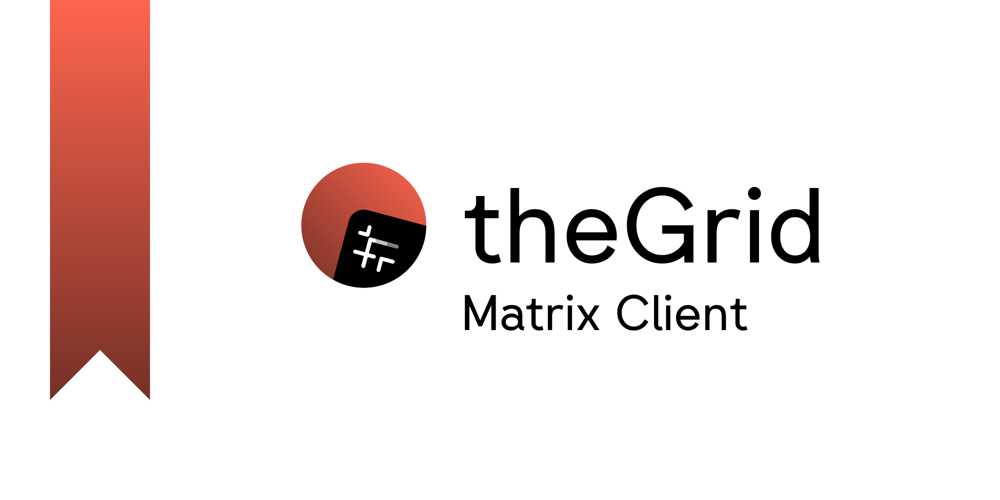
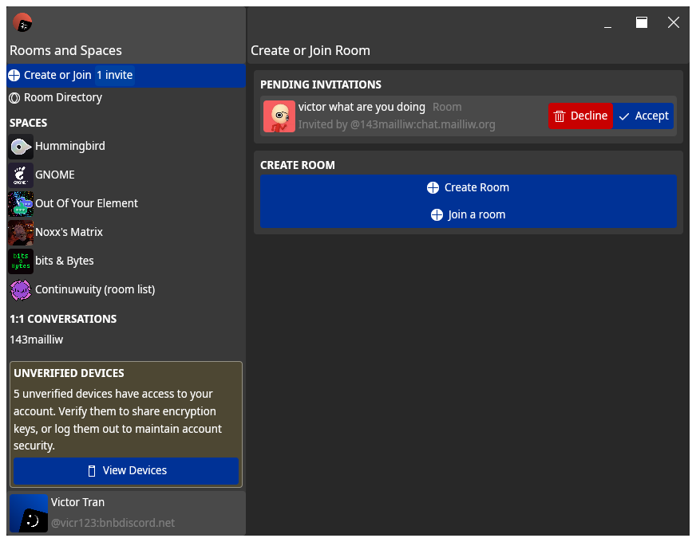
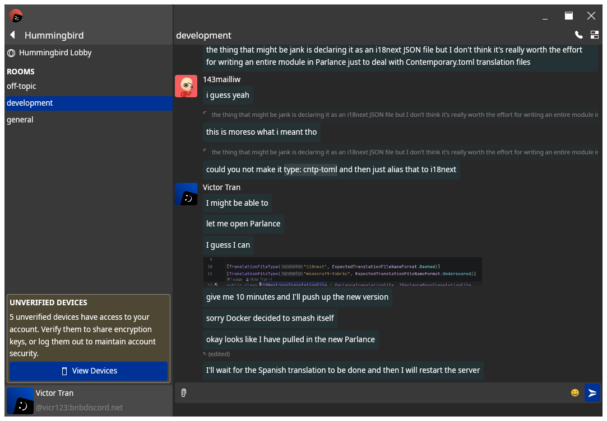
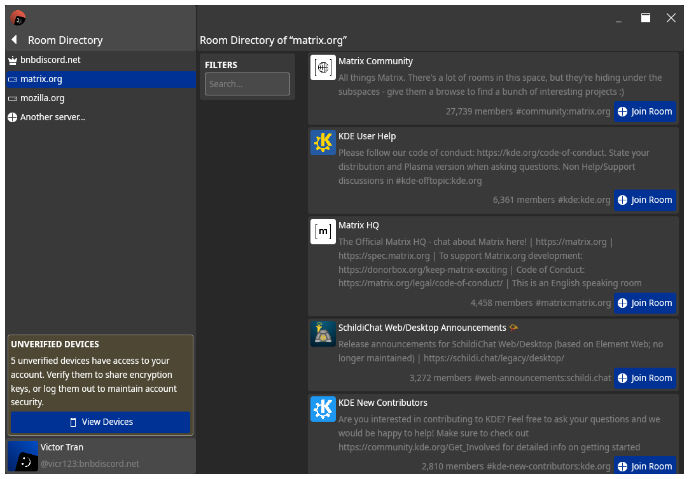
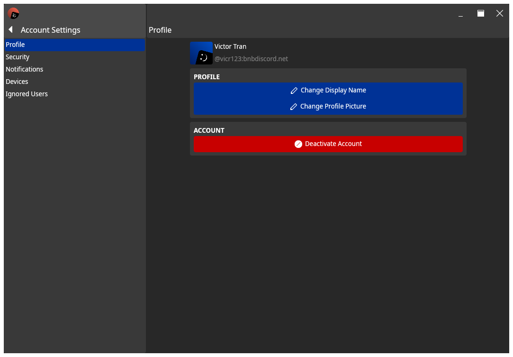
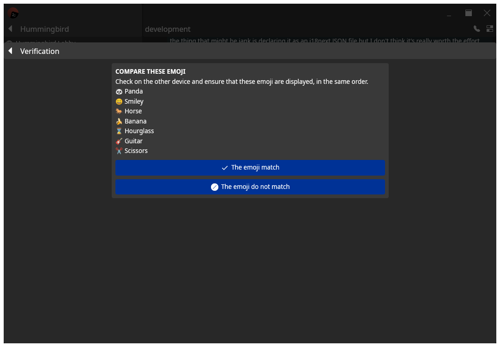
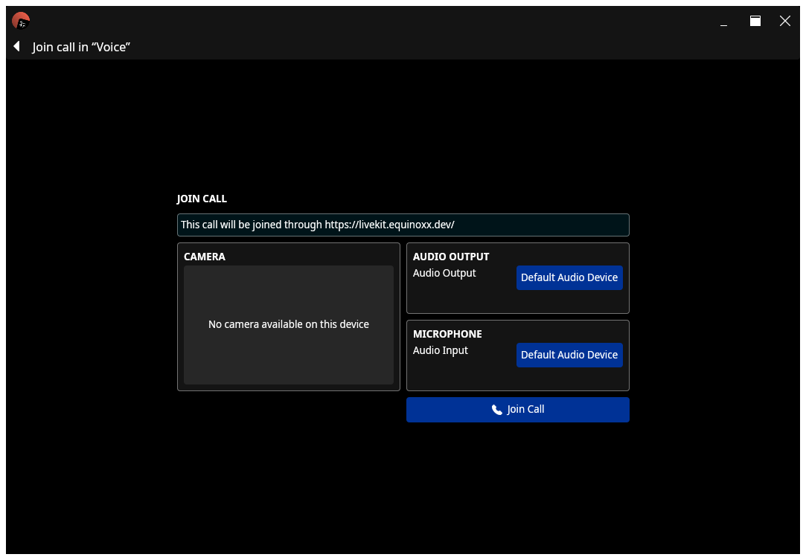

---
<p align="center">

[//]: # ()


<a href="https://parlance.vicr123.com/projects/thegrid"></a>
<a href="https://parlance.vicr123.com/projects/thegrid"></a>
</p>

A cross-platform [Matrix](matrix.org) client written in Rust, with the [GPUI](https://www.gpui.rs/) rendering library.

---

## Build

Run the following commands in your terminal.

```
cargo build
```

---

## Supported Features

theGrid currently supports the following features:

- [ ] Login
    - [X] Username and Password
    - [X] SSO
    - [ ] Native MAS
- [X] Multi-account
- [X] E2EE
    - [X] Cross-Signing
    - [ ] User Verification
- [ ] Chat Features
    - [X] Text Messages
    - [X] Attachments
    - [ ] Replies
    - [ ] Edits
    - [ ] Redactions
    - [ ] Reactions
    - [X] Read Receipts
    - [X] Typing Indicators
    - [ ] Polls
- [ ] Room Management
    - [X] Create New Room
    - [X] Join Existing Room
        - [X] By Alias
        - [X] By matrix.to link
        - [X] By Homeserver Directory
    - [X] Room Settings
    - [X] Invites
    - [X] Knocking
- [X] Spaces
    - [X] Room Categorisation
    - [X] Join Space Rooms
    - [ ] Space Management
- [ ] Threads
    - [ ] Create Thread
    - [ ] Focus Thread
- [ ] Message Search
- [ ] Account Settings
    - [X] Update User Profile
    - [X] Session Management
        - [X] Emoji Verification
        - [X] Recovery Key Verification
        - [X] Recovery Key Management
        - [X] Forced Log Out
    - [X] Ignored Users
- [ ] Notifications
- [X] Element Call
    - [X] Voice Chats
    - [X] Incoming Video and Screen Sharing
    - [X] Outgoing Webcam
    - [X] Screen Sharing
        - [ ] Application Audio Sharing

*If a feature isn't listed here, it does not necessarily mean that support is not planned - I may have just forgotten
about the feature!*

---

## Screenshots

As at the time of writing :)








---

> © Victor Tran, 2026. This project is licensed under the GNU General Public License, version 3, or at your option, any
> later version.
>
> Check the [LICENSE](LICENSE) file for more information.